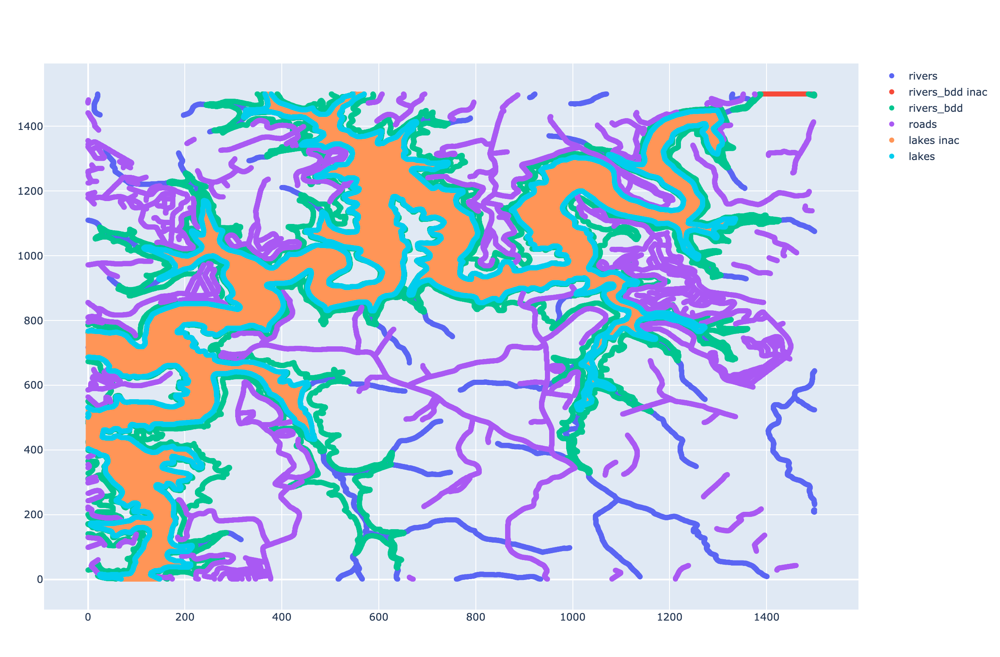
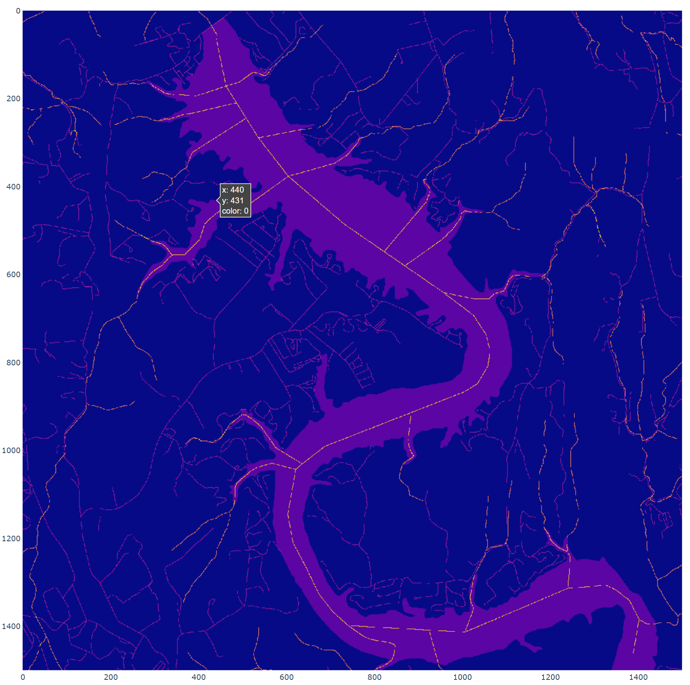

# ARCGIS Tools

## Basic Run

To get terrain information for a specific lat/lon point, run `feature_set.py` in the main directory with desired settings in `main`

Part of the script runs in MATLAB so it is necessary to have it available on your computer. In the main method of that script, there is a set of parameters that define the set of locations to examine, the extent of the output files, the resolution of the terrain map, and so on. These parameters will have an effect upon the run time of the script.

Upon finishing, the matlab_data folder will be populated with the `.mat` files containing binary information for feature layers, terrain gradients, and inaccessible areas.

## Figures

Results from `feature_set.py` with plotting turned on:

* Example of all layers stacked: 

* Example of river layer boundaries: 

